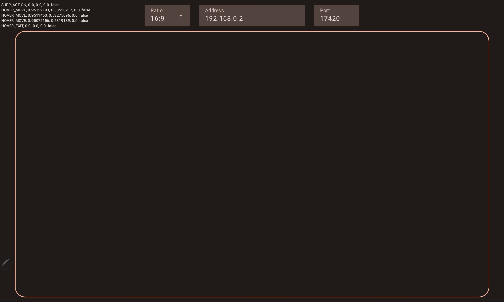

# PenFerry Android App 🖊️🚢

PenFerry's Android application serves as a bridge to relay stylus interactions from an Android device to a Windows machine. By capturing specific stylus events and gestures, it ensures a seamless experience across platforms.

## Overview 🌐

Designed with precision and efficiency in mind, PenFerry for Android captures a range of stylus actions and transmits them in real-time to its Windows counterpart. The application embodies the Material You design, ensuring a modern and intuitive user experience.

## Features 🌟

- **Stylus Event Capture**:
    
    - **Movements**: Direct correspondence to stylus movements on the Android device.
    - **Primary Button**: Currently, only the primary stylus button is supported.
    - **Supplemental Action**: A unique action is triggered when the screen area is tapped with two fingers.
- **Quick Setup**: Easily configure the target address and port for a smooth connection.
    
- **Real-time Transmission**: Experience immediate reflection of your stylus actions on the Windows side.
    

## Installation 🛠️

### Using Android Studio:

1. Clone the repository.
2. Navigate to the Android directory.
3. Open the project in Android Studio.
4. Build and run the app on your device or emulator.

### Direct APK Installation:

***TODO***

For a swift setup, download the latest APK from the 'Releases' section and install it on your device.

## Getting Started 🚀

1. **Launch the PenFerry Android App**: Once you've installed the app, open it up to begin the setup process.
    
2. **Address & Port Configuration**:
    
    - **Address**: Input the IP address of your Windows machine. While the default is `192.168.0.2`, you'll likely need to adjust this to your specific setup.
    - **Port**: The default port is set to `17420`. Unless you've made changes on the Windows side, this should work just fine.

3. **Ratio Selector**: Before diving in, make sure to adjust the aspect ratio using the ratio selector. This ensures that your stylus movements on the Android device align perfectly with your display.
    
4. **Connect & Play**: With the configurations in place, you're all set! Engage with your stylus on the Android device and watch the actions synchronize seamlessly on the Windows end.
